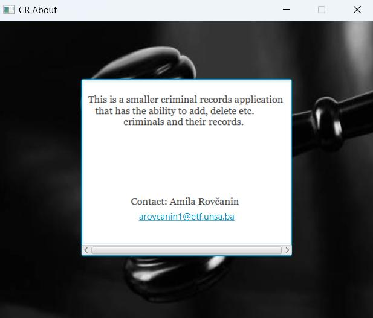
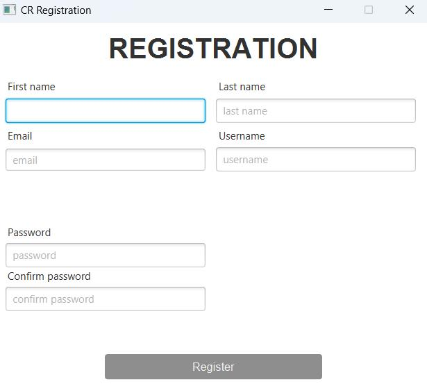
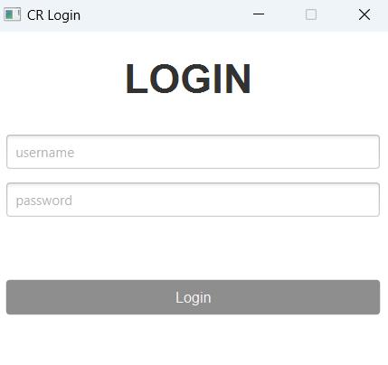
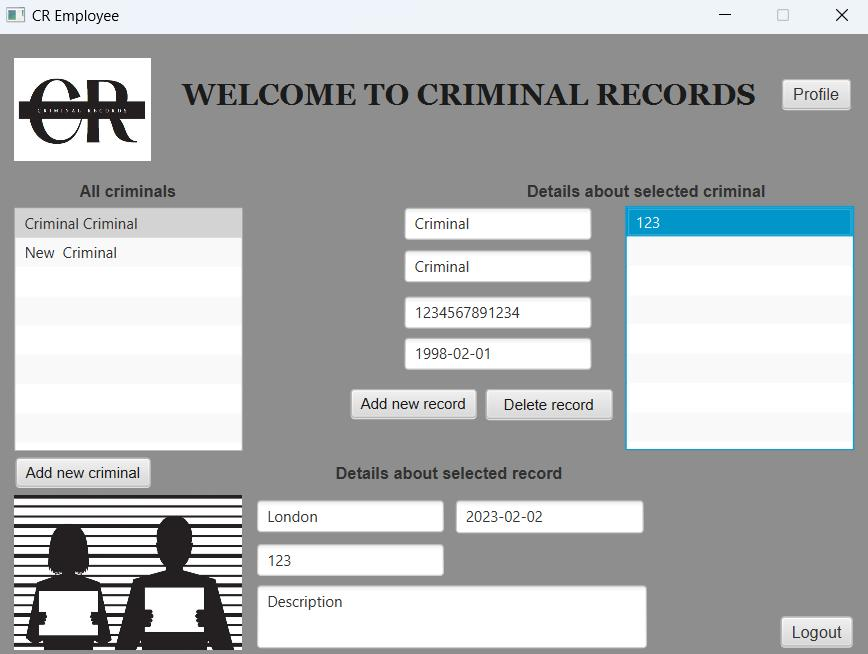
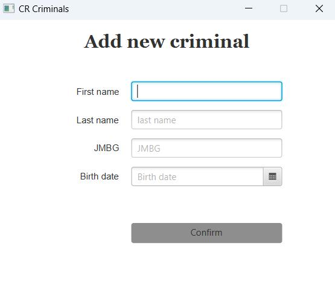
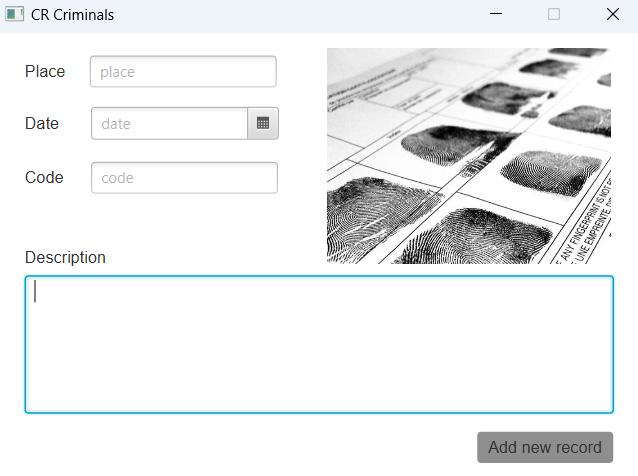
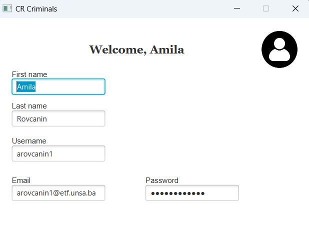

# CriminalRecords
#### This is a smaller javafx application for managing criminals and criminal records. The project was developed using a three-tier software development architecture. A bottom-up approach was used during the development of the application. First, the database design was completed, then the business logic, and finally the user interface. 
#### In the terminal, start the program by typing the following 2 commands:
#### mvn clean install, mvn clean javafx:run

## Screenshots 
### Home
##### 
### About us
##### 
### Registration
##### 
### Login
##### 
### Logged-In User
##### 
### Add new Criminal
##### 
### Add new Record
##### 
### Profile
##### 

